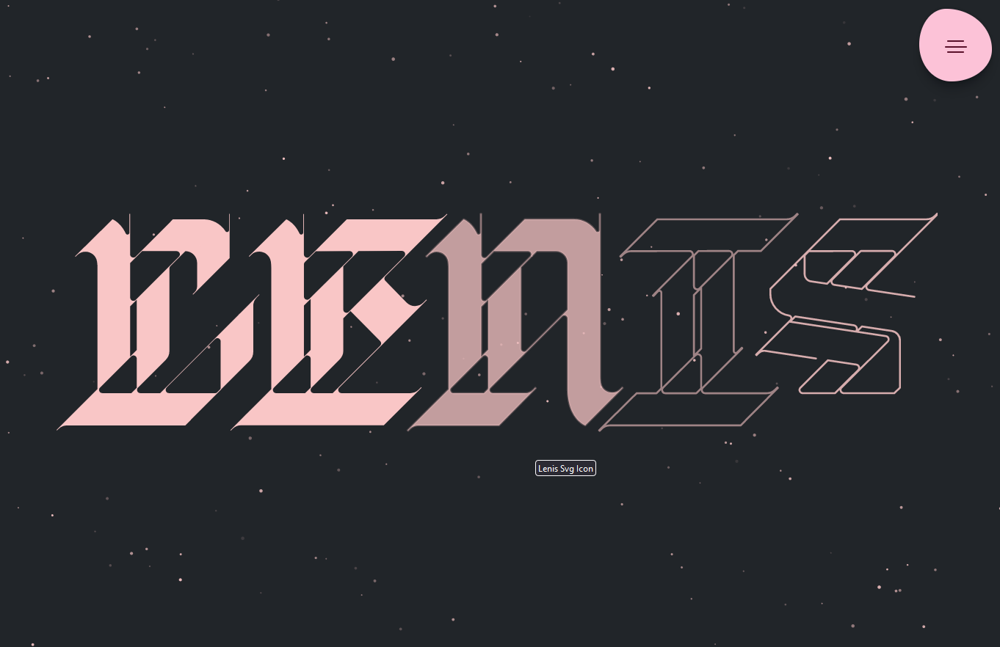

# UnoCSS React Layout

Simple Layout with React, UnoCSS(with Icons), OpenProps, Sass and Postcss.



## Tech Stack

**Client:** React, React Particles, ClassNames, UnoCSS, Open Props, Transition Style, Postcss with Sass.

## Features

- Pnpm, Vite
- Rome, Stylelint, Husky and Lint-staged

## Run Locally

Clone the project

```bash
  git clone https://github.com/AliBagheri2079/UnoCSS-OpenProps-Sass-Layout.git


```

Install dependencies

```bash
  pnpm install


```

Start the server

```bash
  pnpm run dev


```

Format the Component

```bash
  pnpm run format


```

Lint(Check) the Component

```bash
  pnpm run check


```

## 🚀 About Me

I'm Ali Bagheri. Learning about 3 years on Frontend Development Position ...

## 🔗 Links

[](https://github.com/AliBagheri2079)

[](https://www.linkedin.com/in/alibagheri2079/)

[](https://twitter.com/AliBagheri2079)
